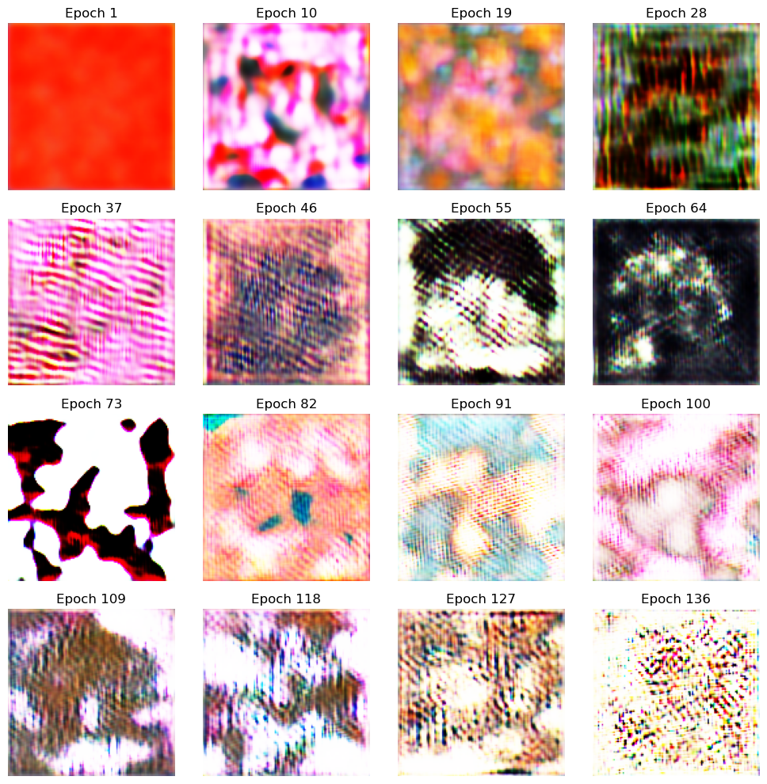

# ai_artist

## Overview

This project aims to take any image dataset as input and generate new examples resembling the original dataset.

The 'Artist' consists of a Generative Adversarial Network (GAN). This is made up of two neural networks, a discriminator model and a generator model. A training step is defined in the GAN class to train both of these models at the same time.

The discriminator is rewarded for correctly identifying whether an image is 'real' (part of the dataset) or 'fake' (produced by the generator model). The generator model is rewarded if the output it produces is classified as 'real' by the discriminator and penalised otherwise.

Over time, the discriminator should get better at distinguishing between 'real' and 'fake' images, which should enable the generator to produce better images (and vice versa).

## Dataset

I used the Abstract Art Gallery dataset consisting of 2782 images: https://www.kaggle.com/datasets/bryanb/abstract-art-gallery 

## Tools
- Google Collab for access to GPU
- Connected to my google drive account to save images/model parameters etc.
- TensorFlow

## Most recent results

The following shows an example image produced by the generator at the given epochs during training. Note that results are only shown up until the 136th epoch. In reality, this GAN would need to be trained for much longer to see if the model is capable of generating images similar to those in the dataset. 

At the time of writing I was limited by google collab GPU limitations which limited training to ~150 epochs - so I'll have to return to this at some point in the future and train for longer!

## References 
- https://github.com/nicknochnack/GANBasics
